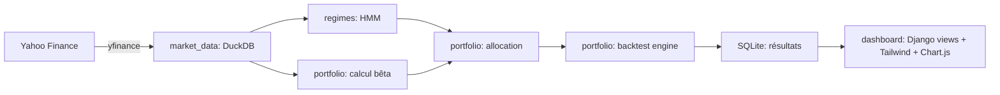

# Architecture technique

## 1. Stack

- **Backend** : Python 3.11+, Django
- **Base de données analytique** : DuckDB (données de marché, calculs vectorisés HMM/bêta)
- **Base de données applicative** : SQLite (modèles Django : configuration, résultats de backtest, historique)
- **Frontend** : Django Templates + Tailwind CSS (via `django-tailwind`) + Chart.js (graphiques interactifs)
- **Data science** : `pandas`, `numpy`, `yfinance`, `hmmlearn`, `statsmodels` (régressions bêta), `duckdb` (Python API)
- **Tests** : `pytest` / `pytest-django`

## 2. Découpage en apps Django

```
projet_hmm_cac40/
├── manage.py
├── config/                        # Réglages Django (settings, urls, wsgi/asgi)
│   ├── settings.py
│   ├── urls.py
│   └── ...
├── apps/
│   ├── market_data/                # Récupération & stockage des données Yahoo Finance
│   │   ├── models.py               # Modèles Django (métadonnées, statut d'import)
│   │   ├── services/
│   │   │   ├── yahoo_fetcher.py    # Téléchargement yfinance
│   │   │   └── duckdb_store.py     # Écriture/lecture DuckDB
│   │   └── management/commands/    # Commandes Django (ex: `import_donnees_marche`)
│   │
│   ├── regimes/                     # Modèle HMM de détection de régimes
│   │   ├── models.py                # Modèle Django : RegimeDetecte (date, régime, probas)
│   │   ├── services/
│   │   │   ├── hmm_model.py         # Entraînement / prédiction HMM (hmmlearn)
│   │   │   └── features.py          # Construction des variables d'observation
│   │   └── management/commands/     # Commande pour ré-entraîner/mettre à jour le HMM
│   │
│   ├── portfolio/                    # Bêta, allocation, backtest
│   │   ├── models.py                  # PortefeuilleSnapshot, Transaction, BetaAction
│   │   ├── services/
│   │   │   ├── beta_calculator.py     # Calcul du bêta glissant
│   │   │   ├── allocation.py          # Règles de sélection des paniers + anti-churn
│   │   │   ├── backtest_engine.py     # Simulation du portefeuille dans le temps
│   │   │   └── metriques.py           # Sharpe, Sortino, Calmar, VaR, etc.
│   │   └── management/commands/       # Commande pour lancer un backtest complet
│   │
│   └── dashboard/                     # Interface utilisateur
│       ├── views.py                   # Vues (accueil, détail backtest, comparaison)
│       ├── templates/dashboard/       # Templates Tailwind
│       └── static/dashboard/          # JS Chart.js, assets
│
├── docs/                              # Documentation de paramétrage (ce dossier)
├── data/                              # Fichiers DuckDB, exports CSV bruts
├── theme/                             # App django-tailwind (générée automatiquement)
├── requirements.txt
└── README.md
```

## 3. Flux de données (schéma logique)



## 4. Principes de code

- **Code annoté en français**, docstrings et commentaires clairs.
- **Séparation stricte** logique métier (`services/`) / modèles Django (`models.py`) / présentation (`views.py`, templates) — pas de calculs lourds dans les vues.
- **Commandes Django (`management/commands/`)** pour toutes les opérations longues (import de données, entraînement HMM, backtest complet) afin de pouvoir les lancer en ligne de commande ou déclencher depuis l'interface (bouton "Relancer le backtest").
- **Fichiers de configuration centralisés** (`config/parametres.py` ou fichiers `.yaml`/`.json` dans `docs`/`config`) pour tous les seuils/paramètres métier (seuils bêta, fenêtres glissantes, coûts de transaction...) — **aucun paramètre en dur dans le code métier**.
- **Tests unitaires** sur les fonctions de calcul critiques (bêta, métriques de performance, règles d'allocation) avant intégration dans le pipeline complet.

## 5. Points à trancher en implémentation (non bloquants pour le paramétrage)

- Choix définitif de la fréquence de ré-entraînement walk-forward du HMM (proposition : 63 jours, à valider empiriquement).
- Choix de la méthode de VaR (historique vs paramétrique).

## 6. Décisions de démarrage (Phase 1)

- Projet Django initialisé dès la Phase 1 (pas de script indépendant transitoire) : dossier `config/` pour les settings, apps regroupées dans `apps/`.
- Dépôt git initialisé avec `.gitignore` (`.venv/`, `*.duckdb`, `*.sqlite3`, `__pycache__/`, `*.pyc`).
- `main.py` supprimé (remplacé par `manage.py`).
- Dépendances en versions minimales non bornées (`>=`) dans `requirements/base.txt` et `requirements/dev.txt`.
